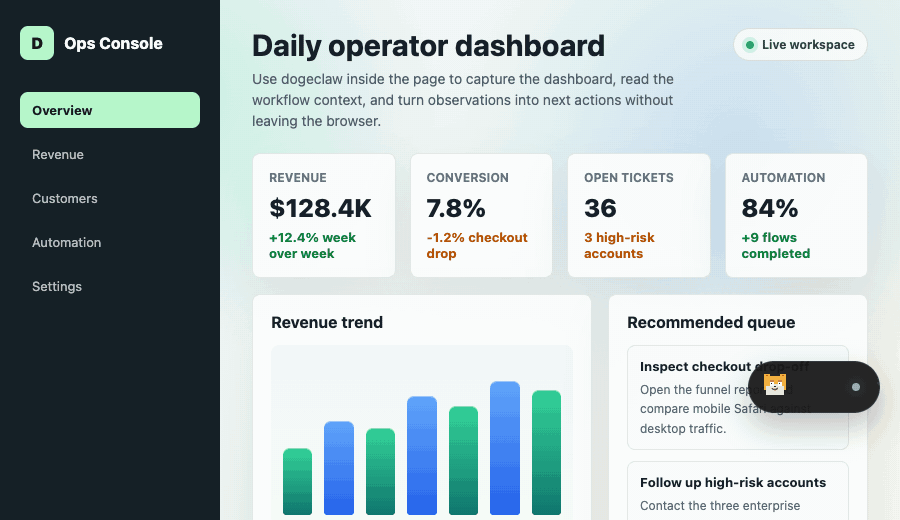

<p align="center">
  
</p>

<h1 align="center">dogeclaw</h1>

<p align="center">
  Chrome にそのまま読み込める browser-side AI agent。ページ内チャット、ツール呼び出し、ブラウザ操作、スクリーンショット、スケジュールタスク、Skills、任意の WeChat メッセージ連携を Web ページに持ち込みます。
</p>

<p align="center">
  <a href="README.md">English</a>
  · <a href="README.zh-CN.md">简体中文</a>
  · 日本語
</p>

<p align="center">
  <a href="#demo">Demo</a>
  · <a href="#highlights">Highlights</a>
  · <a href="#features">Features</a>
  · <a href="ROADMAP.md">Roadmap</a>
  · <a href="#quick-start">Quick Start</a>
  · <a href="#configuration">Configuration</a>
  · <a href="#privacy-and-permissions">Privacy</a>
  · <a href="#development">Development</a>
</p>

## Demo

<p align="center">
  
</p>

## What Is It?

dogeclaw は、ローカルファーストのブラウザ AI アシスタントです。Chrome の unpacked extension として動作し、Web ページにドラッグ可能なフローティングペットを追加し、ページ内チャットパネルを開き、browser-side tool を呼び出し、設定した OpenAI-compatible Chat Completions プロバイダーと連携します。

別のデスクトップアプリを立ち上げず、リポジトリに API Key を含めず、実際の Web ページ上で browser-side agent を素早く検証したい開発者やチーム向けです。

## Highlights

- **Agent がブラウザの中で動く**: 現在のページとチャットし、インタラクティブ要素を読み取り、クリック、入力、スクロール、遷移、タブ作成、スクリーンショット取得まで 1 つの拡張機能で扱えます。
- **site-specific tools を重視**: 業務システム、管理画面、分析ダッシュボード、金融ツールには固有の流れがあります。dogeclaw は汎用的な視覚自動化だけに頼らず、対象サイトに合わせた focused tool call を作る方向を取ります。
- **ローカルで簡単に開始**: Chrome の Developer mode でリポジトリを読み込み、自分の OpenAI-compatible プロバイダーを設定すればすぐに試せます。
- **メッセージチャンネルに対応しやすい構成**: 任意の WeChat チャンネルでは、QR ログイン、long polling、メッセージ処理、メディア処理、モデルによる返信をサポートします。
- **永続的なスケジュールタスク**: 一回限りのリマインダーや繰り返しタスクを、job 定義、runtime state、run history、差し替え可能な alarm provider に分けた scheduler で扱います。
- **openclaw と補完関係**: dogeclaw はブラウザ側の action とサイト固有ツールに集中します。将来的な A2A 連携では、openclaw が広い agent orchestration を担い、dogeclaw がページ上の実行を担当できます。

## Features

- 対応 Web ページ上のドラッグ可能なフローティングアシスタント
- ストリーミング応答に対応したページ内チャット UI
- OpenAI-compatible プロバイダー設定: Base URL、Model、API Key、System Prompt
- Agent loop と tool calling
- 入力欄の Slash commands: `/new`、`/model`、`/skills`、`/tasks`
- ローカル Skill の読み込みと `/skills` 管理。必要な focused tool guidance を有効/無効にできます
- `chrome.alarms` provider の上に構築された永続的な scheduled tasks。scheduler API は provider から分離されています
- `/tasks` 管理パネル: enable/pause switch、次回実行、pause reason、最近の run status
- スケジュールタスクの結果は作成元のチャットタブへ返します。元のタブに届かない場合、別ページへ fallback しません
- ブラウザ制御ツール: current tab、list tabs、new tab、navigate、snapshot、screenshot、click、type、scroll、back、forward、reload
- 選択テキストをアシスタントへ送る右クリックメニュー
- チャット内に表示できるスクリーンショット artifact
- 天気検索ツール
- 任意の WeChat QR ログイン、long polling、メッセージ処理、メディア対応
- English、简体中文、日本語のローカライズ
- Chrome、Edge、Firefox の build target

## Good Fits

- 任意の Web ページで選択テキストを要約、翻訳、書き換え
- 読んでいるページから離れず、その場で質問
- ダッシュボード、業務バックオフィス、EC 管理画面、金融ツールなど専門サイト向け browser agent のプロトタイプ作成
- pixel や DOM 推論だけに頼らず、site-specific tool call で自動化を安定させる
- 一回限りのリマインダーや繰り返しの browser-side agent job を作り、作成元ページへ結果を返す
- ブラウザ側の action を WeChat など外部メッセージチャンネルにつなぐ

## Quick Start

1. このリポジトリを clone または download します。
2. Chrome で `chrome://extensions/` を開きます。
3. Developer mode を有効にします。
4. Load unpacked をクリックします。
5. リポジトリのルートディレクトリを選択します。
6. 任意の Web ページを開く、または更新します。右下に dogeclaw のフローティングボタンが表示されます。

拡張機能ファイルを変更した後は、`chrome://extensions/` の拡張機能カードで Reload をクリックし、テスト中のページを更新してください。

## Configuration

dogeclaw には API Key は含まれていません。チャットや agent tool を使う前に、フローティングパネルを開き、自分の OpenAI-compatible プロバイダーを設定してください。

| Field | Example |
| --- | --- |
| Base URL | `https://api.openai.com/v1` |
| Model | `gpt-4o-mini` |
| API Key | 利用するプロバイダーの Key |

API Key は Chrome extension storage に保存されます。OpenAI、DashScope-compatible gateway、DeepSeek-compatible gateway、OpenRouter-style gateway、または OpenAI-compatible Chat Completions API を提供するその他のサービスを利用できます。

### Slash Commands And Skills

ページ内の入力欄で `/` を入力すると command menu が開きます。

| Command | Purpose |
| --- | --- |
| `/new` | 現在の会話をクリア |
| `/model` | LLM Provider 設定を開く |
| `/skills` | bundled skills を管理 |
| `/tasks` | scheduled tasks を管理 |

Skill は、特定の workflow で agent が tool を選び使うためのローカル instruction file です。現在は current-page search と weather 向けの bundled skills があり、`/skills` から有効/無効を切り替えられます。

### Scheduled Tasks

dogeclaw は `scheduled_task` tool で background scheduled job を作成できます。scheduler は job definition、runtime state、run history を分けて保存し、`chrome.alarms` は現在の wake-up provider としてだけ扱います。

対応する schedule:

| Kind | Use case |
| --- | --- |
| `once` | 「10 分後」や特定の未来時刻の一回限りのリマインダー |
| `interval` | 「30 分ごと」など明示的な繰り返し間隔 |
| `daily` | ブラウザローカル時刻で毎日実行 |
| `weekly` | 指定した曜日に毎週実行 |

一回限りの job は自動実行が成功するとデフォルトで削除されます。手動実行では削除されません。ページから作成された job で元のタブに到達できない場合、dogeclaw は job を pause して理由を記録し、別ページへ結果を送る fallback は行いません。

### Optional WeChat Channel

フローティングパネルからチャンネル設定画面を開き、QR ログインを開始して設定完了を待ちます。有効化すると、dogeclaw は WeChat チャンネルのメッセージをポーリングし、受信内容を処理し、設定済みの LLM Provider で返信できます。

## Privacy And Permissions

dogeclaw はローカルのブラウザ拡張機能として動作しますが、アシスタントへ送信した内容は、設定したモデルプロバイダーへ送られる場合があります。これには入力プロンプト、選択テキスト、ページコンテキスト、スクリーンショット、ツール結果、scheduled task の prompt/result、WeChat チャンネル内容が含まれます。

ストア公開または正式インストール前に、[Privacy Policy](PRIVACY.md) と [Chrome Web Store compliance notes](docs/chrome-store-compliance.md) を確認してください。

要求する extension permissions:

| Permission | Purpose |
| --- | --- |
| `activeTab` | 現在アクティブなページとやり取りする |
| `scripting` | アシスタント用スクリプトを注入する |
| `storage` | ローカルのモデル設定とチャンネル設定を保存する |
| `alarms` | チャンネル polling と scheduled-task wake-up をスケジュールする |
| `tabs` | タブ状態とブラウザ操作を調整する |
| `contextMenus` | 選択テキスト用の右クリックメニューを追加する |
| `<all_urls>` | Web ページ上でアシスタントを読み込む |

プライベートなページや機密情報を送る前に、利用するモデルプロバイダーのデータポリシーを確認してください。

## Project Layout

| Path | Purpose |
| --- | --- |
| `manifest.json` | Chrome development manifest |
| `manifest/` | ブラウザ別 manifest template |
| `content/` | ページ内アシスタント UI、browser action bridge、styles |
| `background.js` | Service worker routing、agent calls、tools、channels、scheduled-task delivery |
| `agent.js` | Agent loop と streaming orchestration |
| `tools.js` | モデルへ公開する tool schema |
| `browser.js` | Browser-control tool runtime |
| `skills.js` | Bundled skill loading、filtering、settings |
| `scheduler.js` | Scheduled job definitions、runtime state、run history、alarm provider |
| `channels/wechat.js` | WeChat login、polling、messaging、media handling |
| `ui.js` | ページ内 UI rendering helpers |
| `i18n.js` | English、Simplified Chinese、日本語の runtime strings |
| `config.js` | Runtime storage keys、limits、feature defaults |
| `llm.js` | OpenAI-compatible LLM client |
| `platform/extension-api.js` | Chrome/Edge/Firefox API adapter |
| `scripts/build-extension.mjs` | Chrome、Edge、Firefox build script |

## Development

JavaScript 構文チェック:

```sh
npm run check
```

ブラウザ別の拡張機能ディレクトリを build:

```sh
npm run build:chrome
npm run build:edge
npm run build:firefox
```

生成物は `dist/<target>` に出力されます。Chrome と Edge の日常開発ではリポジトリルートを直接読み込めます。Firefox では生成された `dist/firefox/manifest.json` temporary add-on を読み込んでください。

Browser API を追加する場合は、機能モジュールから `chrome.*` や `browser.*` を直接呼ばず、`platform/extension-api.js` を経由してください。これにより cross-browser compatibility を 1 つの layer に集約できます。

公開前の推奨チェック:

```sh
rg -n "apiKey|secret|token|password|Authorization|Bearer|sk-" .
npm run check
```

## Contributing

browser-side agent capabilities、site-specific tools、provider compatibility、WeChat channel reliability、documentation、i18n まわりの貢献を歓迎します。

プロジェクトの方向性と貢献テーマは [ROADMAP.md](ROADMAP.md) を参照してください。

Pull Request を開く前に:

- Chrome Developer mode で変更した workflow をテストしてください。
- `npm run check` を実行してください。
- API Key、token、cookie、local logs、`.env` files、生成された extension packages、private screenshots はコミットしないでください。
- ユーザーに見える UI text を変更する場合は、English、Simplified Chinese、日本語の UI strings を同期してください。

詳細は [CONTRIBUTING.md](CONTRIBUTING.md) を参照してください。

## Third-Party Notices

- `vendor/qrcode-generator.js` は Kazuhiko Arase による QR Code Generator for JavaScript をベースにしており、MIT License で提供されています。

## License

MIT。詳細は [LICENSE](LICENSE) を参照してください。
